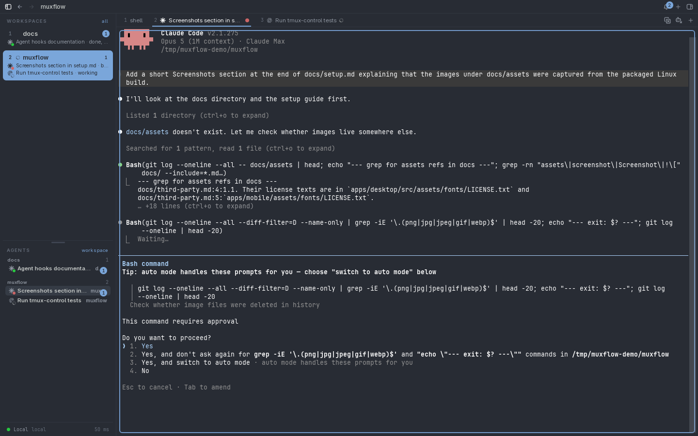
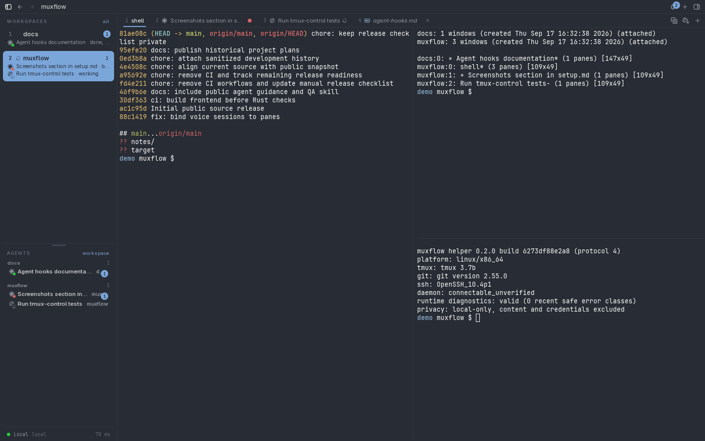
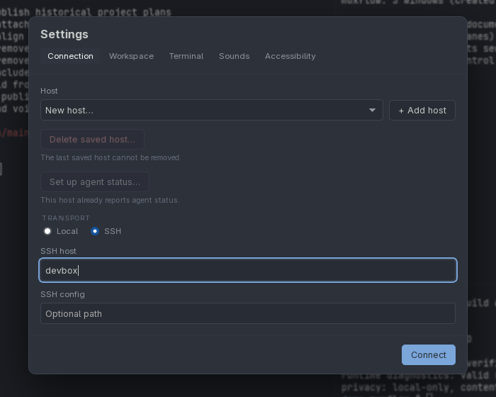
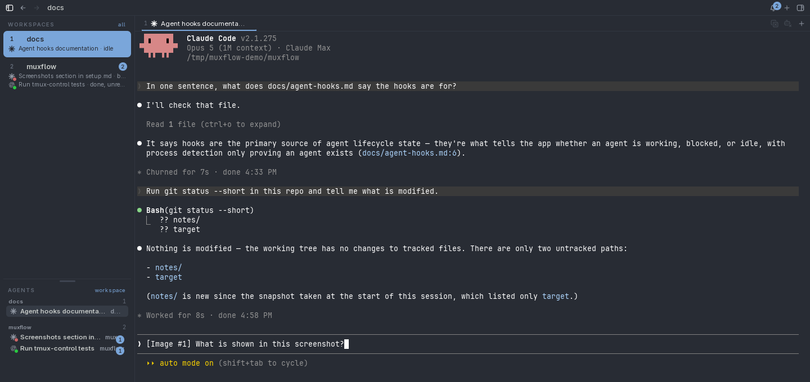
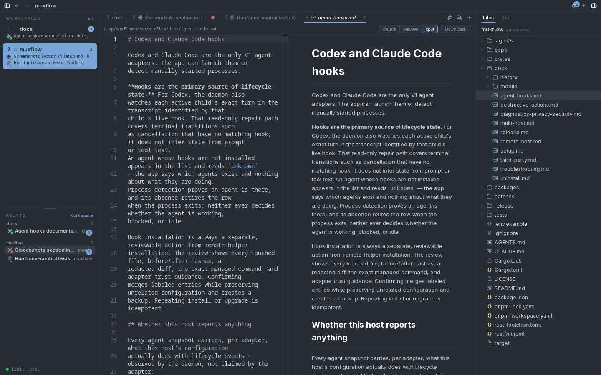
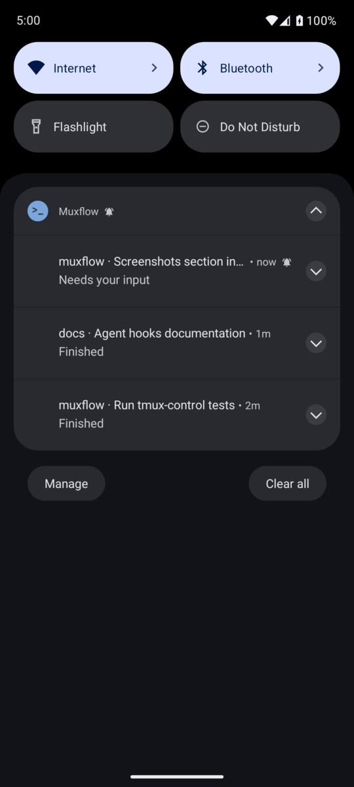
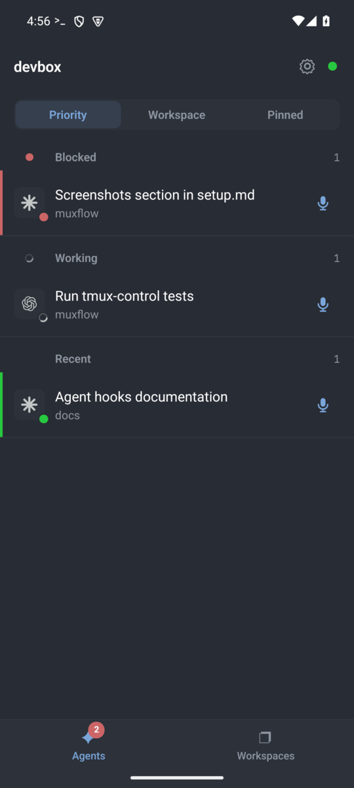
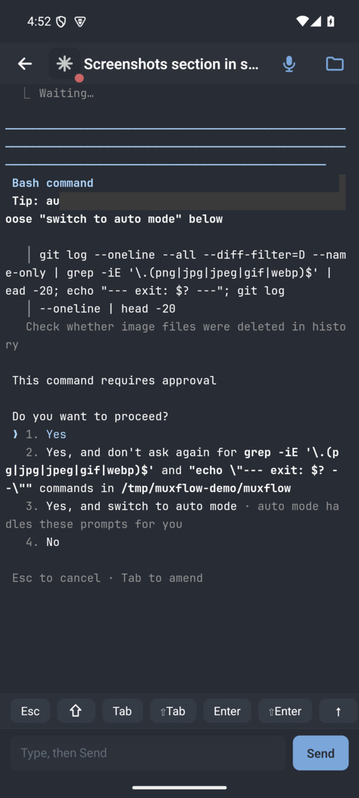
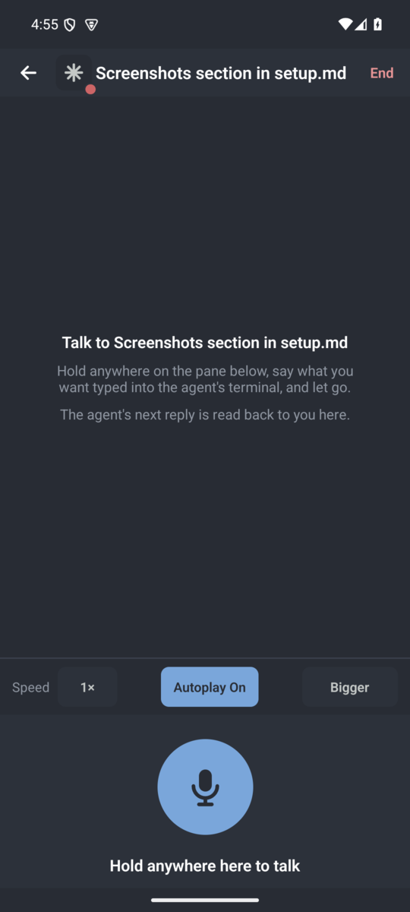
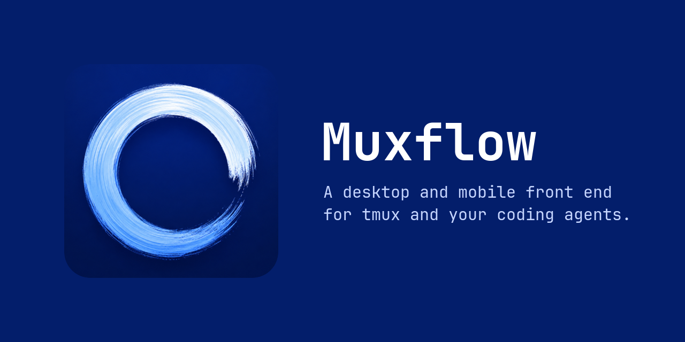

<div align="center">


# Muxflow

**A desktop and mobile front end for tmux and your coding agents.**

[](./LICENSE)
[](#linux)
[](#macos)
[](#android)



</div>

Muxflow mirrors an existing tmux server. tmux stays authoritative for sessions,
windows, panes, and the processes inside them; Muxflow adds a graphical
terminal, editor, file explorer, Git view, and a sidebar that tells you which
Codex or Claude Code agent needs you next. Close the window, switch machines,
or open the Android app: every session keeps running on the host.

## Features

<table>
<tr>
<td width="50%" valign="middle">

### tmux based

Sessions stay on the host. Close the app, reboot your laptop, or switch machines and every window, pane, and process is still there when you come back. Sessions are workspaces, windows are tabs, and renames flow both ways.

</td>
<td width="50%" valign="middle"></td>
</tr>
<tr>
<td width="50%" valign="middle">

### Works across SSH

Attach to a [remote host](./docs/remote-host.md) through your existing OpenSSH config. The helper talks over SSH and a private Unix socket, never a TCP port, and several hosts can be shown [side by side](./docs/multi-host.md).

</td>
<td width="50%" valign="middle"></td>
</tr>
<tr>
<td width="50%" valign="middle">

### Native paste across SSH

Copy a screenshot or a file on your laptop and paste it into a pane on a remote host. Muxflow uploads it over the same SSH connection and drops the path into the terminal, so Codex or Claude Code sees the image as if it were local.

</td>
<td width="50%" valign="middle"></td>
</tr>
<tr>
<td width="50%" valign="middle">

### File explorer and transfers

Browse and edit files next to the terminal with a Markdown preview, paste screenshots and files straight into a pane, and download files from the host.

</td>
<td width="50%" valign="middle"></td>
</tr>
<tr>
<td width="50%" valign="middle">

### Notifications on desktop and mobile

Get told when a Codex or Claude Code agent blocks on a question or finishes, whether you are at the desk or on your phone. Lifecycle comes from reviewable [agent hooks](./docs/agent-hooks.md).

</td>
<td width="50%" align="center" valign="middle"></td>
</tr>
<tr>
<td width="50%" valign="middle">

### Mobile

The Android app shows your agents and their state, lets you read an agent's terminal and type a reply, browse files, and start new agents in any workspace.

</td>
<td width="50%" align="center" valign="middle"> </td>
</tr>
<tr>
<td width="50%" valign="middle">

### Voice mode

Hold to talk to an agent from your phone. Replies come back as voice messages, walkie-talkie style.

</td>
<td width="50%" align="center" valign="middle"></td>
</tr>
<tr>
<td width="50%" valign="middle">

### Cross platform

macOS, Linux, Android, and iOS.

</td>
<td width="50%" valign="middle"></td>
</tr>
</table>

## Supported agents

Codex and Claude Code have lifecycle adapters. Any other CLI agent runs as an
ordinary tmux window without attention tracking.

## Install

Downloads are published on the
[releases page](https://github.com/gal064/muxflow/releases/latest).
tmux 3.3 or newer must be installed on every host you attach to. There is no
auto-update. When a newer release is published, the desktop title bar and the
Android home screen show a red **Update** pill that opens its release page.

### Linux

Download `muxflow-<version>-linux-x86_64.tar.gz`, then:

```sh
tar -xzf muxflow-*-linux-x86_64.tar.gz
cd muxflow-*-linux-x86_64
./install.sh
muxflow
```

The default rootless prefix is `~/.local`; set `ADE_INSTALL_PREFIX` for another
location. See [setup](./docs/setup.md) and [uninstall](./docs/uninstall.md).

### macOS

Download `Muxflow_<version>_aarch64.dmg` (Apple Silicon only), drag
`Muxflow.app` to `/Applications`, and open it. The app is not notarized by
Apple, so macOS blocks the first launch. To allow it, open System Settings →
Privacy & Security and choose **Open Anyway**, or run
`xattr -dr com.apple.quarantine /Applications/Muxflow.app`.

### Android

Download the APK from the releases page and sideload it. The app connects to a
host that already has the Muxflow helper installed from the desktop.

## Build from source

Requirements: Rust 1.97.1, Node.js 24, pnpm 11, tmux 3.3+, and the
[Tauri 2 platform prerequisites](https://v2.tauri.app/start/prerequisites/).

```sh
pnpm install --frozen-lockfile
pnpm test:transport:local
tmux new-session -s work
pnpm tauri dev
```

Package builds: `pnpm release:linux -- x86_64`, `pnpm release:macos`, and
`pnpm mobile:apk:release`. Details are in the
[release guide](./docs/release.md).

## Documentation

- [Setup](./docs/setup.md) and [SSH hosts](./docs/remote-host.md)
- [Key bindings](./docs/keybindings.md)
- [Agent hooks](./docs/agent-hooks.md)
- [Diagnostics, privacy, and security](./docs/diagnostics-privacy-security.md)
- [Troubleshooting](./docs/troubleshooting.md)
- [Release guide](./docs/release.md) and [test suite](./tests/README.md)
- [Historical plans](./docs/history/README.md)

## License

Muxflow source is licensed under [MIT](./LICENSE). The bundled JetBrains Mono
fonts retain their own license in the desktop and mobile font directories. The
optional speech model is downloaded separately; its upstream and conversion
model cards are linked in [third-party notices](./docs/third-party.md).
