<div align="center">


# Muxflow

**Remote-first tmux IDE for coding agents.**

[](./LICENSE)
[](#install)
[](#install)
[](#install)

<a href="https://gal064.github.io/muxflow/">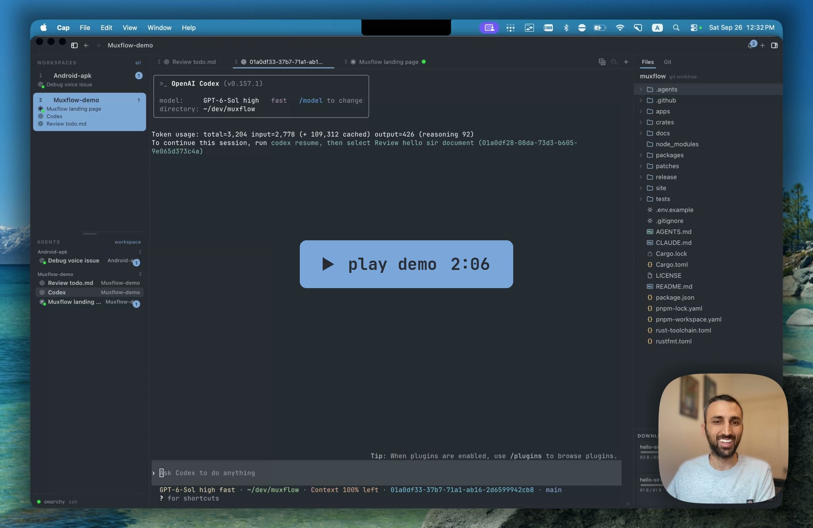</a>

</div>

Agent notifications on desk and phone, voice replies, screenshot paste over
SSH, multi-host, ports, files, and Git.

## Features

<table>
<tr>
<td width="50%" valign="middle">

### tmux based

Sessions stay on the host. Close the app, reboot your laptop, or switch machines and every window, pane, and process is still there when you come back. Sessions are workspaces, windows are tabs, and renames flow both ways.

</td>
<td width="50%" valign="middle">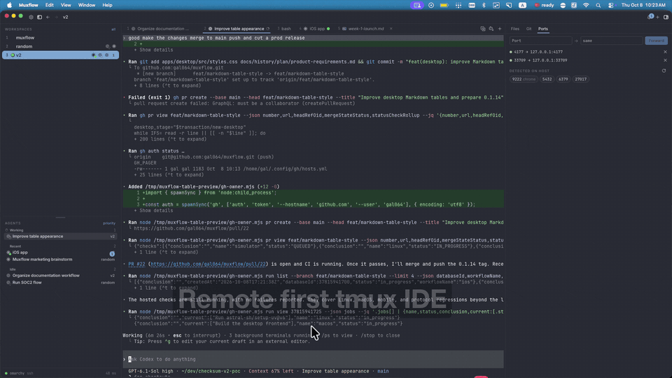</td>
</tr>
<tr>
<td width="50%" valign="middle">

### Works across SSH

Attach to a [remote host](./docs/remote-host.md), Linux or macOS, through your existing OpenSSH config. The helper talks over SSH and a private Unix socket, never a TCP port, and several hosts can be shown [side by side](./docs/multi-host.md). The Ports tab lists what is listening on the host and forwards a port to your machine with one click.

</td>
<td width="50%" valign="middle">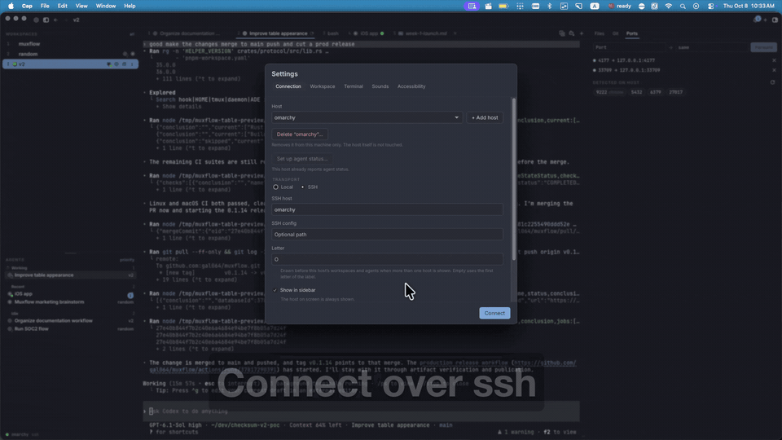</td>
</tr>
<tr>
<td width="50%" valign="middle">

### Native paste across SSH

Copy a screenshot or a file on your laptop and paste it into a pane on a remote host. Muxflow uploads it over the same SSH connection and drops the path into the terminal, so Codex or Claude Code sees the image as if it were local.

</td>
<td width="50%" valign="middle">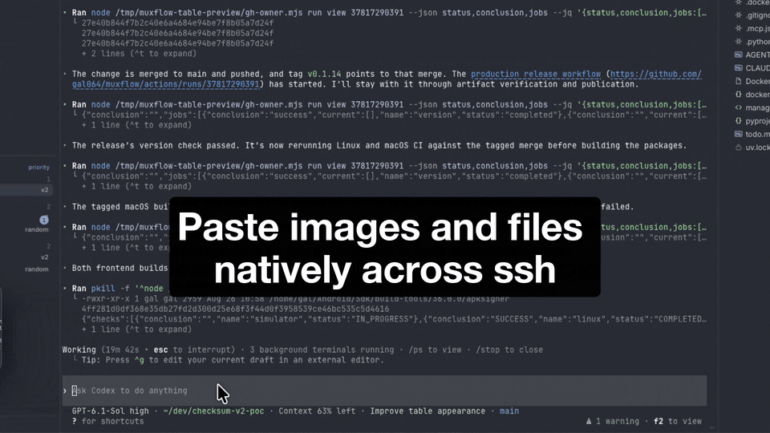</td>
</tr>
<tr>
<td width="50%" valign="middle">

### File explorer and transfers

Browse and edit files next to the terminal with a Markdown preview, paste screenshots and files straight into a pane, and download files from the host.

</td>
<td width="50%" valign="middle">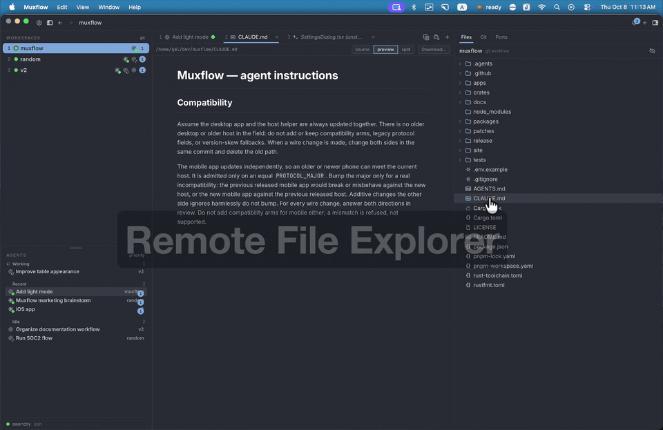</td>
</tr>
<tr>
<td width="50%" valign="middle">

### Git

Diff, stage, commit, and push on the host without leaving Muxflow.

</td>
<td width="50%" valign="middle">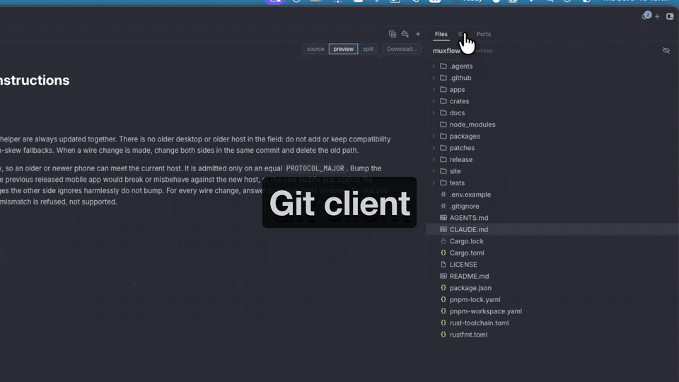</td>
</tr>
<tr>
<td width="50%" valign="middle">

### Ports

See what is listening on an SSH host and forward a port to your machine with one click. Forwards stop when Muxflow does.

</td>
<td width="50%" valign="middle">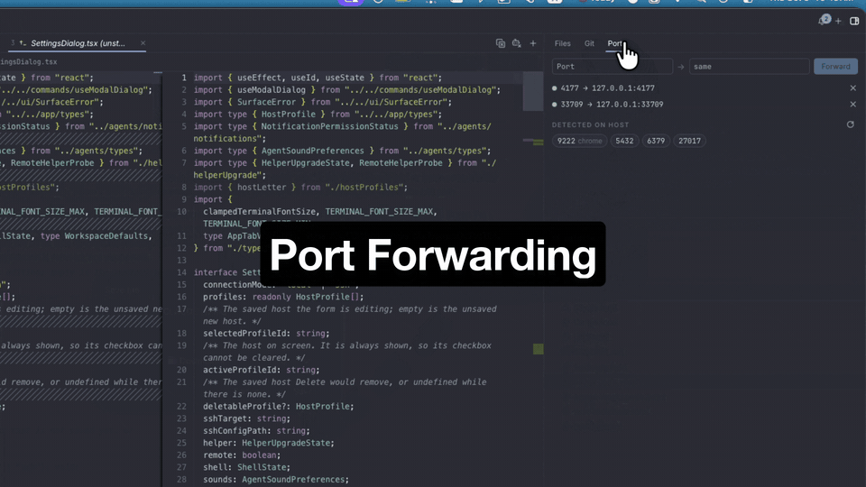</td>
</tr>
<tr>
<td width="50%" valign="middle">

### Notifications on desktop and mobile

Get told when a Codex or Claude Code agent blocks on a question or finishes, whether you are at the desk or on your phone. Lifecycle comes from reviewable [agent hooks](./docs/agent-hooks.md).

</td>
<td width="50%" align="center" valign="middle">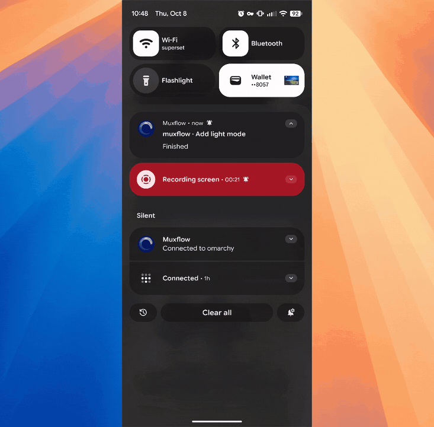</td>
</tr>
<tr>
<td width="50%" valign="middle">

### Mobile

The Android app shows your agents and their state, lets you read an agent's terminal and type a reply, browse files, and start new agents in any workspace.

</td>
<td width="50%" align="center" valign="middle">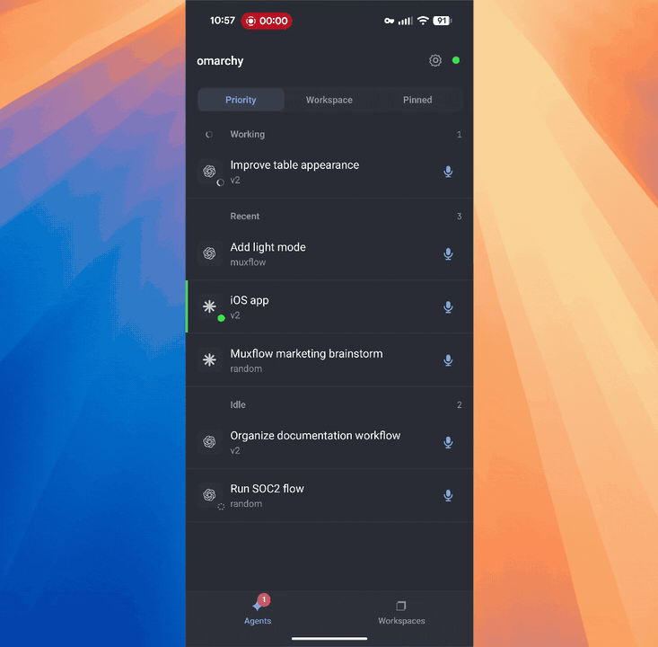</td>
</tr>
<tr>
<td width="50%" valign="middle">

### Voice mode

Hold to talk to an agent from your phone. Replies come back as voice messages, walkie-talkie style.

</td>
<td width="50%" align="center" valign="middle">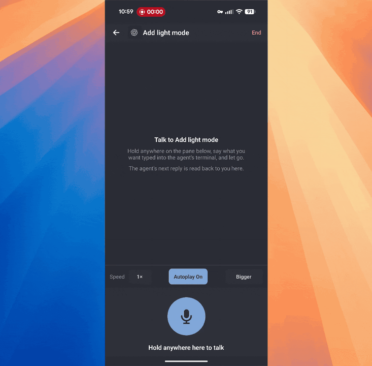</td>
</tr>
<tr>
<td width="50%" valign="middle">

### Cross platform

macOS, Linux, and Android. iOS is coming soon.

</td>
<td width="50%" valign="middle">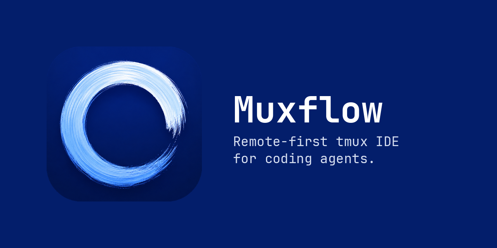</td>
</tr>
</table>

## Supported agents

Codex and Claude Code have lifecycle adapters. Any other CLI agent runs as an
ordinary tmux window without attention tracking; add your own with
[agent hooks](./docs/agent-hooks.md).

## Install

```sh
curl -fsSL https://github.com/gal064/muxflow/releases/latest/download/install.sh | bash
```

Make sure [tmux](https://github.com/tmux/tmux/wiki/Installing) is installed on
your machine and on every machine you connect to.

For Android, install the APK from the
[releases page](https://github.com/gal064/muxflow/releases/latest).

## Connect to a remote machine

1. Make sure tmux 3.3 or newer is installed on the remote machine.
2. Make sure you can run `ssh <host>` from your terminal without extra flags.
   Muxflow uses your OpenSSH config, keys, and agent, so an alias in
   `~/.ssh/config` works too.
3. In Muxflow, click the host name at the bottom left, choose
   **Connection settings…**, and click **+ Add host**.
4. Select **SSH** and enter the host or config alias in **SSH host**.
5. Click **Check helper**, then **Install helper…** to put the helper in
   `~/.local/bin` on the remote machine. No root needed.
6. Click **Connect**.

Optionally, click **Set up agent status…** to get Codex and Claude Code
notifications from that machine. More in [SSH hosts](./docs/remote-host.md).

## Troubleshooting

### Muxflow can't connect to tmux

Make sure the latest tmux is installed on your machine and on the machine
you're connecting to (3.3 or newer is required).

### Notifications don't appear

Open **Settings** and click **Send test notification** under **System
notifications**. If nothing appears, check System Settings → Notifications →
Muxflow.

### The connection drops or lags

1. Open **Settings**, select the host, and click **Check helper**. If it offers
   **Install helper…** or **Upgrade helper…**, click it to get the latest
   helper.
2. Make sure you have a good internet connection and that SSH is available on
   both your machine and the remote machine.
3. Check CPU usage on the remote machine. High CPU there often causes lag, and
   it's easy to miss because it happens on the other machine.

### Codex agents show "unknown"

Codex 0.157 and newer run a shared background server that hides which pane an
event came from. Muxflow starts new tmux panes without it.

1. Start Codex again in a new pane or tab. Codex windows opened before Muxflow
   connected still use the background server.
2. If you set `CODEX_EXEC_SERVER_URL` yourself, Muxflow leaves it alone and
   Codex status won't work.

More in the [troubleshooting guide](./docs/troubleshooting.md).

## Build from source

Requirements: Rust 1.97.1, Node.js 24, pnpm 11, tmux 3.3+, and the
[Tauri 2 platform prerequisites](https://v2.tauri.app/start/prerequisites/).

```sh
pnpm install --frozen-lockfile
pnpm test:transport:local
tmux new-session -s work
pnpm tauri dev
```

Package builds: `pnpm release:linux -- x86_64`, `pnpm release:macos`, and
`pnpm mobile:apk:release`. Details are in the
[release guide](./docs/release.md).

## Documentation

- [Setup](./docs/setup.md) and [SSH hosts](./docs/remote-host.md)
- [Key bindings](./docs/keybindings.md)
- [Agent hooks](./docs/agent-hooks.md)
- [Diagnostics, privacy, and security](./docs/diagnostics-privacy-security.md)
- [Privacy policy](./site/privacy/README.md)
- [Troubleshooting](./docs/troubleshooting.md)
- [Release guide](./docs/release.md) and [test suite](./tests/README.md)
- [Historical plans](./docs/history/README.md)

## License

Muxflow source is licensed under [MIT](./LICENSE). The bundled JetBrains Mono
and Inter fonts retain their own licenses in the desktop and mobile font
directories. The optional speech model is downloaded separately; its upstream and conversion
model cards are linked in [third-party notices](./docs/third-party.md).
